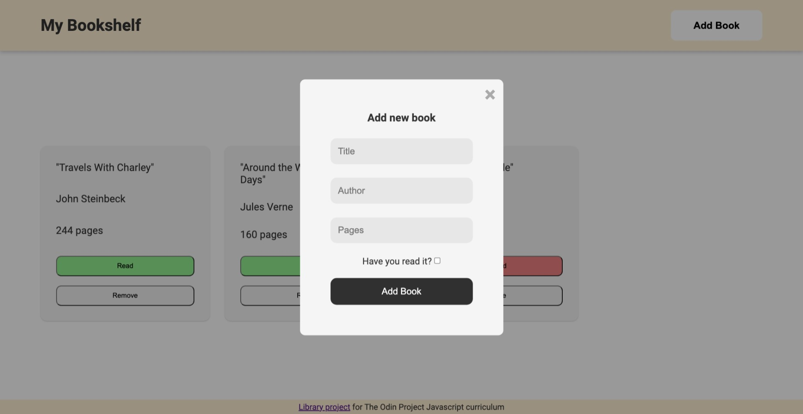
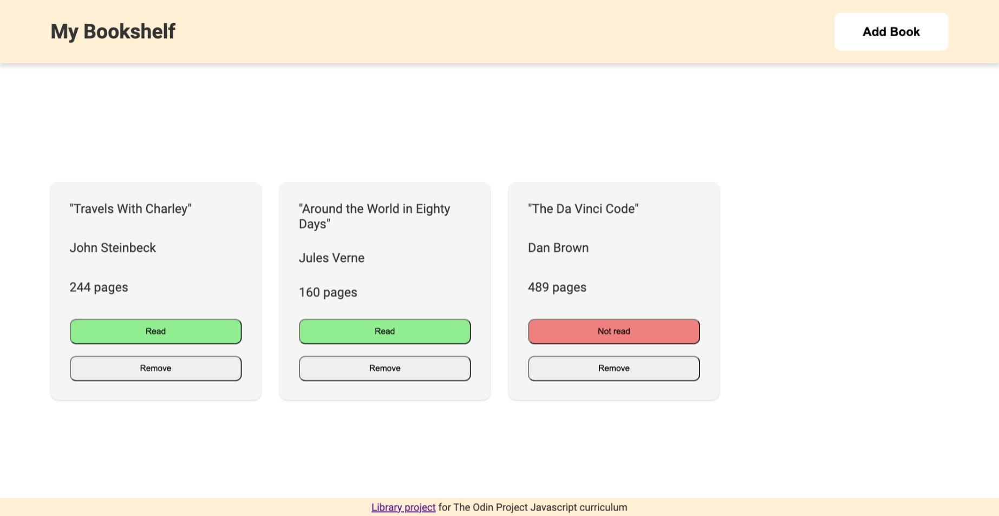

# bookshelf-app

This is a solution to the [library project on The Odin Project](https://www.theodinproject.com/lessons/node-path-javascript-library)).

## Overview

## Features

- Empty state background
- Pop-up form modal and overlay
- Generating HTML elements in JS
- Populating a grid with elements
- Toggling/removing items

## Built with

- Semantic HTML5 markup
- Object-oriented JS
- CSS Grid
- Flexbox

### Preview

